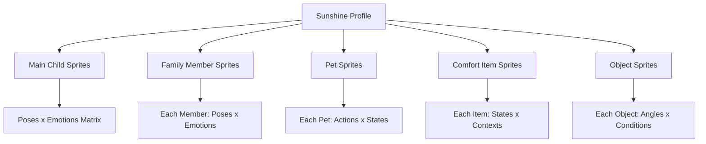

# 🏗️ Enhanced LucianMirror Architecture for MySunshineStories

## Overview

LucianMirror needs to handle **multiple sprite packs per user profile**, not just the main child character. Each Sunshine profile can include family, pets, comfort items, and special objects that all need consistent sprite representation.

## 📦 Sprite Pack Structure



## 🔄 Complete Workflow

### 1. **Profile Intake & Sprite Generation**

When a MySunshineStories user completes their profile:

```python
profile_data = {
    "child": {
        "id": "child_123",
        "name": "Emma",
        "photos": ["photo1.jpg", "photo2.jpg"],
        "age": 5
    },
    "family_members": [
        {
            "id": "family_456",
            "name": "Mom",
            "relationship": "mother",
            "photos": ["mom_photo.jpg"]
        },
        {
            "id": "family_789",
            "name": "Dad",
            "relationship": "father",
            "photos": ["dad_photo.jpg"]
        }
    ],
    "pets": [
        {
            "id": "pet_001",
            "name": "Buddy",
            "type": "dog",
            "photos": ["dog_photo.jpg"]
        }
    ],
    "comfort_items": [
        {
            "id": "item_001",
            "name": "Mr. Bear",
            "type": "stuffed_animal",
            "photos": ["bear_photo.jpg"]
        }
    ]
}

# LucianMirror generates sprite packs for EVERYTHING
sprite_packs = await lucian_mirror.generate_profile_sprites(profile_data)
```

### 2. **Background Generation from Story**

The story text drives background generation:

```python
story = "Emma was in her cozy bedroom with her teddy bear..."

# SSP analyzes the scene
scene_analysis = ssp.analyze(story)
# Returns: {setting: "bedroom", mood: "cozy", time: "evening", objects_needed: ["teddy_bear"]}

# Generate background WITHOUT characters
background = await generator.create_background(
    setting="bedroom",
    style="watercolor",
    mood="cozy",
    exclude_characters=True  # Important!
)
```

### 3. **Sprite Composition Layer**

This is where the magic happens - compositing sprites onto backgrounds:

```python
# The composition engine places sprites intelligently
composed_scene = await compositor.compose(
    background_url=background,
    sprites=[
        {
            "character_id": "child_123",
            "sprite_type": "main_character",
            "pose": "sitting",
            "emotion": "happy",
            "position": {"x": 0.5, "y": 0.7},  # Center, 70% down
            "scale": 0.4
        },
        {
            "character_id": "item_001",
            "sprite_type": "comfort_item",
            "state": "held",
            "position": {"x": 0.48, "y": 0.68},  # Near child
            "scale": 0.15
        },
        {
            "character_id": "family_456",
            "sprite_type": "family",
            "pose": "standing",
            "emotion": "caring",
            "position": {"x": 0.3, "y": 0.65},
            "scale": 0.45
        }
    ]
)
```

## 🧠 How Each Component Works

### **MPU (Memory Processing Unit)**
- Stores ALL sprites for ALL characters/items in a profile
- Multi-dimensional indexing: character + type + pose + emotion
- Instant retrieval for any combination

### **SSP (Symbolic Sense Processor)**
- Parses story to identify WHO and WHAT appears
- Determines emotional context
- Identifies required background elements
- Maps story entities to sprite IDs

### **HASR (Hebbian Reinforcement)**
- Learns which sprite combinations work well
- Tracks successful family groupings
- Optimizes pet placement patterns
- Improves object positioning over time

### **Composition Engine**
Smart layering system that:
- Places main character first (focal point)
- Adds family members in natural positions
- Includes pets at appropriate scales
- Positions comfort items realistically
- Handles depth/overlapping correctly

## 🎮 Standalone Value Proposition

You're absolutely right - this system has massive value beyond MySunshineStories:

### **Game Development**
- Generate complete sprite sheets for indie games
- Consistent character across all animations
- Export to Unity/Godot formats

### **Animation/Video**
- Frame-by-frame sprite sequences
- Transition animations between poses
- Video game cutscene generation

### **Educational Content**
- Personalized learning materials
- Custom character mascots
- Interactive story creation

### **NFT/Digital Art**
- Generative character collections
- Consistent trait combinations
- Rarity system support

## 📊 Database Structure for Sprite Packs

```sql
-- Enhanced schema for multiple sprite types
CREATE TABLE sprite_packs (
    id UUID PRIMARY KEY,
    profile_id VARCHAR(255),  -- Links to Sunshine profile
    pack_type VARCHAR(50),    -- 'child', 'family', 'pet', 'item'
    entity_id VARCHAR(255),   -- Specific family member, pet, etc.
    entity_name VARCHAR(255),
    created_at TIMESTAMP
);

CREATE TABLE sprites (
    id UUID PRIMARY KEY,
    pack_id UUID REFERENCES sprite_packs(id),
    pose VARCHAR(50),
    emotion VARCHAR(50),
    state VARCHAR(50),        -- For items/objects
    sprite_url TEXT,
    thumbnail_url TEXT,
    metadata JSONB,           -- Flexible additional data
    created_at TIMESTAMP
);

CREATE TABLE composition_history (
    id UUID PRIMARY KEY,
    story_id VARCHAR(255),
    scene_index INT,
    background_url TEXT,
    sprites_used JSONB,       -- Array of sprite IDs and positions
    composed_url TEXT,
    success_score FLOAT,      -- For HASR learning
    created_at TIMESTAMP
);
```

## 🔌 API Endpoints for Full System

```python
# Generate sprites for entire profile
POST /api/profiles/generate-sprites
{
    "profile_id": "sunshine_123",
    "include_family": true,
    "include_pets": true,
    "include_items": true,
    "generation_api": "dalle"
}

# Generate background from story text
POST /api/backgrounds/generate
{
    "story_text": "Emma was in the garden...",
    "style": "watercolor",
    "exclude_characters": true
}

# Compose scene with multiple sprites
POST /api/scenes/compose-multi
{
    "background_url": "...",
    "sprites": [
        {"id": "child_123", "type": "main", "pose": "standing"},
        {"id": "mom_456", "type": "family", "pose": "standing"},
        {"id": "dog_789", "type": "pet", "state": "sitting"}
    ],
    "auto_position": true  // AI positions them naturally
}

# Get all sprite packs for a profile
GET /api/profiles/{profile_id}/sprite-packs

# Export for game engine
GET /api/sprites/export?format=unity&profile_id=123
```

## 🚀 Implementation Priority

1. **Phase 1: Core Multi-Entity Support**
   - Update MPU to handle multiple sprite packs
   - Enhance SSP to identify all entities in stories
   - Modify generation to handle different entity types

2. **Phase 2: Smart Composition**
   - Build intelligent positioning algorithm
   - Add depth/layering management
   - Implement scale relationships (child < adult, etc.)

3. **Phase 3: Learning & Optimization**
   - HASR learns optimal arrangements
   - Cache successful compositions
   - Build composition templates

4. **Phase 4: Standalone Features**
   - Game engine export
   - Animation timeline support
   - Batch processing tools

## 💡 Key Insights

1. **Each profile is a universe** - Not just one character, but an entire cast
2. **Backgrounds are generated separately** - From story context, no people
3. **Composition is the magic** - Smart layering of sprites onto backgrounds
4. **Learning improves quality** - HASR makes it better over time
5. **Standalone value is huge** - This is a complete sprite development platform

This architecture makes LucianMirror not just a tool for MySunshineStories, but a comprehensive sprite generation and management platform for any visual storytelling need!