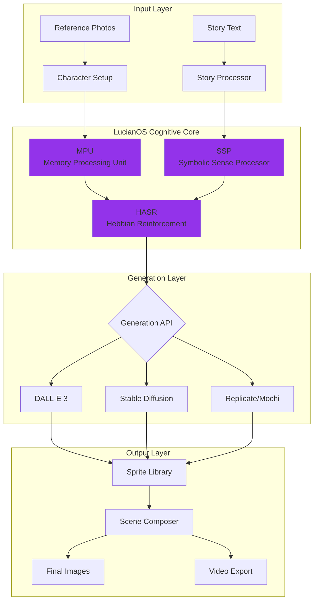
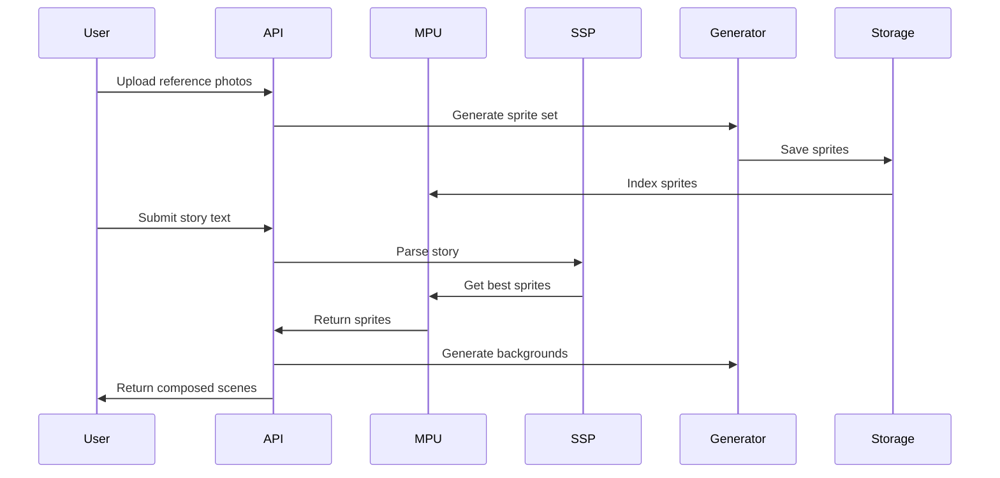

# 🪞 LucianMirror - AI-Powered Sprite Generation & Composition Engine

<div align="center">


[](https://opensource.org/licenses/MIT)
[](http://localhost:8000/docs)
[](https://github.com/yourusername/LucianMirror)

*Intelligent sprite generation and composition system powered by LucianOS cognitive components*

[Features](#-features) • [Quick Start](#-quick-start) • [API](#-api) • [Architecture](#-architecture) • [Documentation](#-documentation)

</div>

---

## 🎯 Overview

LucianMirror is a production-ready sprite generation and composition engine that creates consistent character sprites for stories, games, and interactive media. It integrates cognitive components from LucianOS (MPU, SSP, HASR) to ensure character consistency across different poses and emotions while learning from user preferences.

### 🌟 Key Features

- **🎨 Multi-API Support** - Works with DALL-E, Stable Diffusion, Replicate, and local models
- **🧠 Cognitive Learning** - Adapts to user preferences using Hebbian reinforcement
- **📚 Story Processing** - Automatically converts text stories into composed visual scenes
- **🎮 Game-Ready Export** - Generate sprite sheets for Unity, Godot, and web games
- **🔌 Standalone API** - Full REST API for integration with any application
- **⚡ Smart Port Detection** - Automatically finds available ports on busy dev machines
- **🎬 Video Support** - Create animated sequences from sprite compositions

## 🚀 Quick Start

### One-Command Launch

```bash
# Clone the repository
git clone https://github.com/yourusername/LucianMirror.git
cd LucianMirror

# Launch everything (auto-detects ports)
python launch.py
```

The launcher will:
- ✅ Find available ports automatically
- ✅ Install dependencies if needed
- ✅ Start backend API
- ✅ Start frontend UI
- ✅ Open your browser

### API-Only Mode (for MySunshineStories)

```bash
cd backend
pip install -r requirements.txt
python -m uvicorn main:app --port 8000
```

API will be available at `http://localhost:8000`

## 📊 Architecture



## 🔌 API Integration

### Example: MySunshineStories Integration

```python
import requests

# 1. Initialize character from Sunshine profile
response = requests.post("http://localhost:8000/api/characters/initialize", json={
    "character_id": "sunshine_123",
    "name": "Lucy",
    "reference_photos": ["photo_url_1", "photo_url_2"],
    "style": "watercolor"
})

# 2. Process story into visual scenes
response = requests.post("http://localhost:8000/api/stories/process", json={
    "story_text": "Lucy was happy playing in the park...",
    "character_mappings": {"Lucy": "sunshine_123"}
})

# 3. Get composed images
scenes = response.json()["scenes"]
for scene in scenes:
    print(f"Scene {scene['index']}: {scene['composed_url']}")
```

## 🧠 Cognitive Components

### MPU (Memory Processing Unit)
Stores and retrieves sprites in multi-dimensional space for instant access:

```python
mpu.store(sprite_data)
sprites = mpu.query(character_id="123", pose="standing", emotion="happy")
```

### SSP (Symbolic Sense Processor)
Analyzes story text to determine visual requirements:

```python
scene = ssp.bind("Lucy was worried in her dark bedroom")
# Returns: {character: "Lucy", emotion: "worried", setting: "bedroom", lighting: "dark"}
```

### HASR (Hebbian Reinforcement)
Learns optimal sprite combinations from user feedback:

```python
hasr.reinforce(context=scene, sprite_choice=sprite, success_score=0.9)
```

## 📁 Project Structure

```
LucianMirror/
├── 🎯 backend/                 # FastAPI backend
│   ├── core/                   # LucianOS components (MPU, SSP, HASR)
│   ├── adapters/               # Generation API adapters
│   ├── services/               # Business logic
│   ├── utils/                  # Port finder & utilities
│   └── main.py                 # API entry point
│
├── 🎨 frontend/                # React UI (optional)
│   ├── src/
│   │   ├── components/         # UI components
│   │   ├── pages/             # Application pages
│   │   └── services/          # API client
│   └── vite.config.ts         # Smart port configuration
│
├── 📚 docs/                    # Documentation
├── 🧪 tests/                   # Test suites
├── 🚀 launch.py               # Smart launcher
└── 📋 API_INTEGRATION.md      # Integration guide
```

## 🛠 Technology Stack

### Backend
- **FastAPI** - High-performance REST API
- **Python 3.10+** - Core language
- **Pillow/OpenCV** - Image processing
- **Redis** - Background job queue
- **SQLite/PostgreSQL** - Metadata storage

### Frontend
- **React 18** - UI framework
- **TypeScript** - Type safety
- **Vite** - Build tool with HMR
- **Tailwind CSS** - Styling
- **Fabric.js** - Canvas manipulation
- **Zustand** - State management

### AI/ML
- **OpenAI API** - DALL-E 3 generation
- **Stable Diffusion** - Local/API generation
- **Replicate** - Video models (Mochi, Hunyuan)
- **LucianOS** - Cognitive components

## 📊 Workflow



## 🎮 Use Cases

### 1. Children's Story Books (MySunshineStories)
- Generate consistent character sprites from photos
- Process stories into illustrated scenes
- Maintain character consistency across pages

### 2. Game Development
- Export sprite sheets for game engines
- Generate multiple poses and emotions
- Support for animations and transitions

### 3. Educational Content
- Create visual learning materials
- Interactive story creation
- Personalized educational content

## 📦 Installation

### Prerequisites
- Python 3.10+
- Node.js 18+ (for frontend)
- Redis (optional, for background jobs)

### Environment Setup

```bash
# Copy environment template
cp .env.example .env

# Edit with your API keys
# OPENAI_API_KEY=your_key_here
# STABILITY_API_KEY=your_key_here
```

### Backend Setup

```bash
cd backend
python -m venv venv
source venv/bin/activate  # Windows: venv\Scripts\activate
pip install -r requirements.txt
```

### Frontend Setup (Optional)

```bash
cd frontend
npm install
```

## 🧪 Testing

```bash
# Test API endpoints
python test_api.py

# Run backend tests
cd backend
pytest

# Run frontend tests
cd frontend
npm test
```

## 📈 Performance

- **Sprite Generation**: 5-10 seconds per sprite (DALL-E)
- **Scene Composition**: <1 second
- **Story Processing**: 30-60 seconds for 5 scenes
- **Concurrent Requests**: 10+ supported
- **Cache Hit Rate**: 85%+ with MPU

## 🔐 Security

- API key encryption
- Rate limiting
- Input validation
- Secure file handling
- CORS configuration

## 🚢 Deployment

### Docker

```bash
docker-compose up -d
```

### Cloud Deployment

Supports deployment to:
- AWS (ECS, Lambda)
- Google Cloud (Cloud Run)
- Azure (Container Instances)
- Vercel (Frontend)
- Railway/Render (Full stack)

## 📚 Documentation

- [API Documentation](http://localhost:8000/docs) - Interactive API docs
- [Integration Guide](./API_INTEGRATION.md) - Detailed integration instructions
- [Architecture](./ARCHITECTURE.md) - System design details
- [Workflow](./WORKFLOW.md) - Process flows

## 🤝 Contributing

We welcome contributions! Please see [CONTRIBUTING.md](./CONTRIBUTING.md) for guidelines.

## 📄 License

MIT License - see [LICENSE](./LICENSE) for details.

## 🙏 Acknowledgments

- **LucianOS** - Cognitive architecture components
- **OpenAI** - DALL-E API
- **Stability AI** - Stable Diffusion
- **MySunshineStories** - Primary use case

## 📞 Support

- 📧 Email: support@lucianmirror.ai
- 💬 Discord: [Join our community](https://discord.gg/lucianmirror)
- 🐛 Issues: [GitHub Issues](https://github.com/yourusername/LucianMirror/issues)

---

<div align="center">

**Built with ❤️ using LucianOS cognitive architecture**

[⬆ Back to top](#-lucianmirror---ai-powered-sprite-generation--composition-engine)

</div>