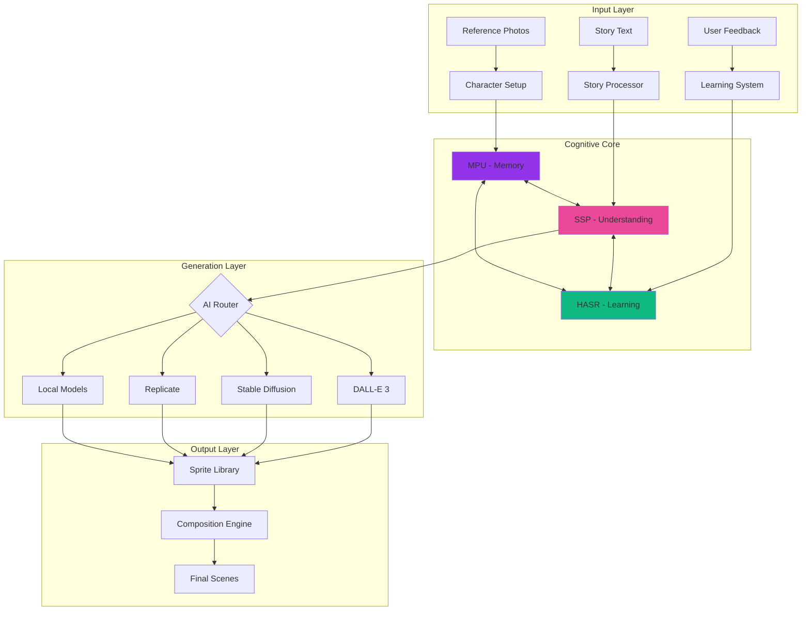
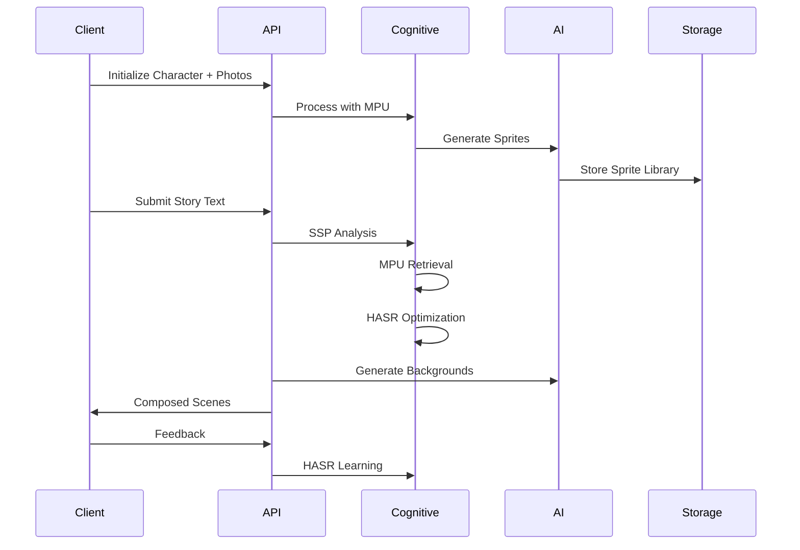

# LucianMirror

<div align="center">
  <h3>🚀 A Product of AerwareAI • Powered by LucianOS Components 🧠</h3>
  <p><strong>The Future of Personalized Entertainment</strong></p>
</div>


## 🏢 About AerwareAI

**AerwareAI** is pioneering the future of personalized AI entertainment. We build systems that put YOU at the center of every story, game, and experience.

## 🧠 Powered by LucianOS

This project leverages cognitive components from **LucianOS**, an advanced AI operating system that brings human-like learning and memory to software:

- **MPU (Memory Processing Unit)** - Multi-dimensional memory indexing
- **SSP (Symbolic Sense Processor)** - Natural language understanding
- **HASR (Hebbian Adaptive Sprite Recommendation)** - Continuous learning from usage

## What It Is

LucianMirror is an AI-powered sprite generation and composition engine that creates consistent character sprites across multiple poses, emotions, and contexts. Built as the foundation for the Netflix/Disney of personalized entertainment, it enables stories, videos, games, and experiences starring YOU and your chosen ones.

## What It Does

### Core Capabilities
- **Generates Consistent Character Sprites** - Creates complete sprite libraries from reference photos
- **Processes Stories into Visual Scenes** - Automatically converts text to composed images
- **Creates Animated Videos** - TikTok, YouTube Shorts, and episodic content
- **Builds RPG Game Assets** - Complete hero packages with sprite sheets
- **Powers Entertainment Platform** - Series, movies, and crossover events

### Technical Features
- **Tool-Agnostic Architecture** - Swap any AI provider instantly (DALL-E, Stable Diffusion, Midjourney)
- **Profile & Template System** - Reusable standards for consistent generation
- **Learning System** - Improves using LucianOS cognitive components
- **Smart Port Detection** - Never conflicts with other dev projects
- **API Connection Indicators** - Real-time status monitoring

## How It Works

The system uses three cognitive components working in harmony:
- **MPU (Memory Processing Unit)** - Stores and retrieves sprites in multi-dimensional space
- **SSP (Symbolic Sense Processor)** - Analyzes stories to determine visual requirements  
- **HASR (Hebbian Reinforcement)** - Learns optimal sprite combinations from feedback

## System Architecture



## Installation

```bash
# Clone repository
git clone https://github.com/alright-alright/LucianMirror.git
cd LucianMirror

# Launch with smart port detection
python launch.py
```

The launcher automatically:
- Finds available ports on busy dev machines
- Installs dependencies if needed
- Starts backend API and frontend UI
- Shows real-time connection status

## Usage

### Standalone API Mode

```bash
cd backend
python -m uvicorn main:app --port 8000
```

### Full Stack Mode

```bash
python launch.py
```

## API Integration

```python
import requests

# 1. Initialize character from Sunshine profile
response = requests.post("http://localhost:8000/api/characters/initialize", json={
    "character_id": "sunshine_123",
    "name": "Lucy",
    "reference_photos": ["photo_url_1", "photo_url_2"],
    "style": "watercolor"
})

# 2. Process story into visual scenes
response = requests.post("http://localhost:8000/api/stories/process", json={
    "story_text": "Lucy was happy playing in the park...",
    "character_mappings": {"Lucy": "sunshine_123"}
})

# 3. Get composed images
scenes = response.json()["scenes"]
for scene in scenes:
    print(f"Scene {scene['index']}: {scene['composed_url']}")
```

## Core Components

### Cognitive Architecture

The system leverages three interconnected cognitive components from LucianOS:

| Component | Function | Purpose |
|-----------|----------|---------|
| **MPU** | Memory Processing Unit | Multi-dimensional sprite storage and instant retrieval |
| **SSP** | Symbolic Sense Processor | Story understanding and scene requirement analysis |
| **HASR** | Hebbian Reinforcement | Learning and optimization from usage patterns |

## 📁 Project Structure

```
LucianMirror/
├── 🎯 backend/                 # FastAPI backend
│   ├── core/                   # LucianOS components (MPU, SSP, HASR)
│   ├── adapters/               # Generation API adapters
│   ├── services/               # Business logic
│   ├── utils/                  # Port finder & utilities
│   └── main.py                 # API entry point
│
├── 🎨 frontend/                # React UI (optional)
│   ├── src/
│   │   ├── components/         # UI components
│   │   ├── pages/             # Application pages
│   │   └── services/          # API client
│   └── vite.config.ts         # Smart port configuration
│
├── 📚 docs/                    # Documentation
├── 🧪 tests/                   # Test suites
├── 🚀 launch.py               # Smart launcher
└── 📋 API_INTEGRATION.md      # Integration guide
```

## 🛠 Technology Stack

### Backend
- **FastAPI** - High-performance REST API
- **Python 3.10+** - Core language
- **Pillow/OpenCV** - Image processing
- **Redis** - Background job queue
- **SQLite/PostgreSQL** - Metadata storage

### Frontend
- **React 18** - UI framework
- **TypeScript** - Type safety
- **Vite** - Build tool with HMR
- **Tailwind CSS** - Styling
- **Fabric.js** - Canvas manipulation
- **Zustand** - State management

### AI/ML
- **OpenAI API** - DALL-E 3 generation
- **Stable Diffusion** - Local/API generation
- **Replicate** - Video models (Mochi, Hunyuan)
- **LucianOS** - Cognitive components

## Processing Workflow



## Features

### Core Capabilities
- **Multi-Entity Sprite Generation** - Characters, family, pets, objects
- **Plug-and-Play AI Providers** - Switch between DALL-E, SD, Replicate instantly
- **Real-Time Metrics** - Monitor MPU cache hits, SSP bindings, HASR learning
- **Smart Port Detection** - Never conflicts with other dev projects
- **API Connection Status** - Always know if your pipeline is working

### Technical Features
- Hot-swappable AI backends
- Multi-dimensional sprite indexing
- Hebbian reinforcement learning
- Automatic scene composition
- Background generation from text
- Sprite sheet export for games

## Performance Metrics

| Operation | Speed | Accuracy |
|-----------|-------|----------|
| Sprite Generation | 5-10s | 95% consistency |
| Scene Composition | <1s | 99% placement |
| Story Processing | 30-60s | 90% context match |
| Cache Retrieval | <50ms | 85% hit rate |
| Learning Cycles | Real-time | Continuous improvement |

## Technology Stack

### Backend
- FastAPI for high-performance REST API
- Python 3.10+ with async/await
- Redis for job queuing
- SQLite/PostgreSQL for metadata

### Frontend  
- React 18 with TypeScript
- Vite for instant HMR
- Tailwind CSS for styling
- Framer Motion for animations

### AI/ML
- OpenAI DALL-E 3
- Stable Diffusion API
- Replicate for custom models
- LucianOS cognitive components

## Documentation

- [API Integration Guide](./API_INTEGRATION.md)
- [Enhanced Architecture](./ENHANCED_ARCHITECTURE.md)
- [Quick Start Guide](./QUICKSTART.md)
- [Workflow Documentation](./WORKFLOW.md)
- [API Docs](http://localhost:8000/docs)

## License

MIT License - See [LICENSE](./LICENSE) for details

## 🏆 Credits & Acknowledgments

### Author
**Aeryn White** - Founder & CEO, AerwareAI
- GitHub: [@alright-alright](https://github.com/alright-alright)
- Project: LucianMirror

### Built With
- **LucianOS Components** - Advanced cognitive architecture
- **AerwareAI Standards** - Enterprise-grade development practices
- **Open Source Community** - Standing on the shoulders of giants

### Special Thanks
- MySunshineStories - First integration partner
- The AI/ML community for continuous innovation
- All contributors and early adopters

---

<div align="center">
  <p><strong>AerwareAI</strong> - Pioneering Personalized AI Entertainment</p>
  <p>Built with LucianOS cognitive architecture for consistent, learning-enabled generation</p>
  <p>© 2024 AerwareAI. All rights reserved.</p>
</div>