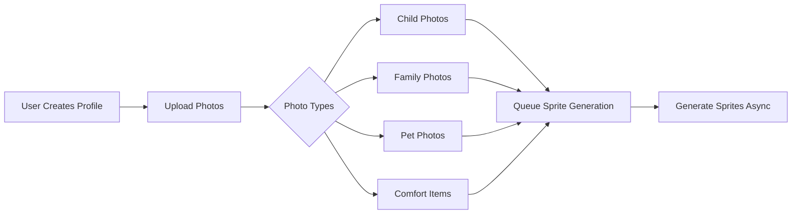
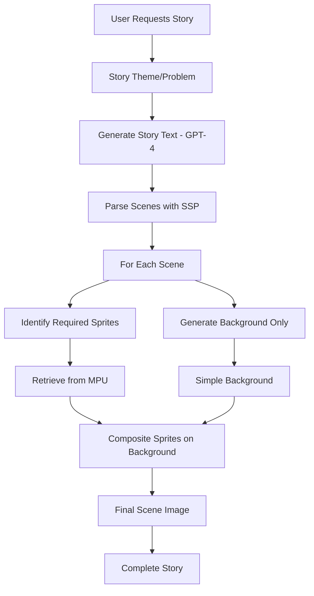

# WORKFLOW: User Journey → Sprite System → Final Output

## 🎯 Complete Workflow Breakdown

### **Step 1: Profile Creation & Initial Sprite Generation**



**What happens:**
1. User uploads photos through your existing MySunshineStories interface
2. Photos are already stored in R2 (your current system)
3. Background job triggered to generate sprites
4. User can start using stories immediately (fallback to old system if sprites not ready)

### **Step 2: Sprite Generation Process (One-Time)**

```python
# Actual workflow in code
async def generate_sprite_set(sunshine_id: str, generation_api: str = "dalle"):
    """
    This runs ONCE when profile is created/updated
    """
    # 1. Load profile and photos from your existing database
    profile = load_sunshine_profile(sunshine_id)
    photos = profile.photos  # Already in R2
    
    # 2. Generate sprites based on API choice
    if generation_api == "dalle":
        # Direct generation with reference
        sprites = await generate_dalle_sprites(photos, profile)
    
    elif generation_api == "stable_diffusion_lora":
        # Train LoRA first (takes 30-60 min)
        lora_model = await train_lora(photos)
        sprites = await generate_sd_sprites(lora_model, profile)
    
    elif generation_api == "stable_diffusion_controlnet":
        # Use ControlNet with reference (no training)
        sprites = await generate_controlnet_sprites(photos, profile)
    
    # 3. What we generate for EACH character:
    sprite_sets = {
        'standing': ['neutral', 'happy', 'sad', 'excited', 'worried'],
        'walking': ['left', 'right', 'towards', 'away'],
        'sitting': ['ground', 'chair', 'reading', 'eating'],
        'action': ['jumping', 'running', 'waving', 'hugging'],
        'sleeping': ['bed', 'couch', 'ground']
    }
    
    # 4. Store in MPU for instant retrieval
    mpu.store(sunshine_id, sprites)
    
    return sprites
```

### **Step 3: Story Request (Using Sprites)**



**The Magic: How It Actually Works**

```python
async def generate_story_with_sprites(story_request):
    """
    This is what happens when user clicks 'Create Story'
    """
    # 1. User inputs (from your existing form)
    problem = story_request.problem  # "afraid of the dark"
    sunshine_id = story_request.sunshine_id
    
    # 2. Generate story text (keep your existing GPT-4 integration)
    story_text = await generate_story_text(problem, sunshine_id)
    # Returns: "Lucy was afraid of the dark. One night..."
    
    # 3. Parse scenes with SSP
    scenes = ssp.parse_story(story_text)
    # Returns: [
    #   {
    #     "text": "Lucy sat in her bed looking worried",
    #     "character": "lucy",
    #     "pose": "sitting",
    #     "emotion": "worried",
    #     "location": "bedroom",
    #     "time": "night"
    #   },
    #   ...
    # ]
    
    # 4. For each scene, compose image
    final_images = []
    for scene in scenes:
        # Get pre-generated sprite
        sprite = mpu.retrieve(
            character=sunshine_id,
            pose=scene.pose,
            emotion=scene.emotion
        )
        
        # Generate ONLY the background (much cheaper/faster)
        background = await generate_background(
            location=scene.location,
            time=scene.time,
            style="watercolor"  # or user preference
        )
        
        # Composite sprite onto background
        final_image = composite(background, sprite, position="center")
        final_images.append(final_image)
    
    return final_images
```

### **Step 4: API-Specific Workflows**

#### **DALL-E Workflow:**
```python
# Most straightforward - works with your current setup
async def dalle_sprite_generation(photo, pose, emotion):
    prompt = f"Character in {pose} position, {emotion} expression, based on reference"
    response = openai.images.generate(
        model="dall-e-3",
        prompt=prompt,
        reference_image=photo,  # If DALL-E adds this feature
        style="consistent character, transparent background"
    )
    return response.url
```

#### **Stable Diffusion + LoRA Workflow:**
```python
# More complex but better consistency
async def lora_sprite_generation(photos, character_name):
    # Step 1: Train LoRA (one-time, 30-60 minutes)
    lora_model = await train_lora_model(
        images=photos,
        model_name=f"{character_name}_lora",
        steps=1000
    )
    
    # Step 2: Generate sprites using trained LoRA
    sprites = []
    for pose in POSE_LIST:
        sprite = await sd_generate(
            prompt=f"{character_name}, {pose}, transparent background",
            lora=lora_model,
            cfg_scale=7,
            steps=20
        )
        sprites.append(sprite)
    
    return sprites
```

#### **Stable Diffusion + ControlNet (No Training):**
```python
# Fast, no training needed
async def controlnet_sprite_generation(reference_photo, pose):
    # Use ControlNet to maintain appearance
    sprite = await sd_controlnet_generate(
        prompt=f"child in {pose} position, transparent background",
        control_image=reference_photo,
        control_type="reference",  # or "openpose" for pose control
        strength=0.8
    )
    return sprite
```

### **Step 5: Background Generation**

```python
async def generate_background(scene_description):
    """
    Backgrounds are MUCH easier - no consistency needed
    """
    # Can use any API - they all do backgrounds well
    background = await generation_api.generate(
        prompt=f"{scene_description}, no characters, empty scene",
        style="children's book illustration",
        size="1024x1024"
    )
    return background
```

### **Step 6: Composition**

```python
def composite_scene(background, sprites, positions):
    """
    Simple image composition - no AI needed
    """
    from PIL import Image
    
    # Load background
    bg = Image.open(background)
    
    # Place sprites
    for sprite, position in zip(sprites, positions):
        sprite_img = Image.open(sprite)
        bg.paste(sprite_img, position, sprite_img)  # Uses alpha channel
    
    return bg
```

## 🔄 Fallback Strategy

```python
async def generate_story_image(scene, sunshine_id):
    """
    Smart fallback system
    """
    # Try sprite system first
    sprites = mpu.retrieve(sunshine_id)
    
    if sprites:
        # Use sprite system
        return await compose_with_sprites(scene, sprites)
    else:
        # Fall back to current DALL-E generation
        return await generate_dalle_image(scene)
```

## 💡 Key Insights

1. **Sprites are generated ONCE**: When profile created, not per story
2. **Only backgrounds change**: Per story/scene
3. **MPU stores everything**: Instant retrieval, no regeneration
4. **SSP parses stories**: Knows which sprites to use
5. **HASR learns**: Which combinations work best
6. **Plug-and-play APIs**: Switch between DALL-E/SD/Mochi with config

## 🚀 Implementation Priority

1. **Week 1**: Basic sprite generation with DALL-E
2. **Week 2**: MPU storage and retrieval  
3. **Week 3**: Background generation + composition
4. **Week 4**: Add Stable Diffusion option
5. **Week 5**: Video support with sprites

This workflow integrates seamlessly with your existing MySunshineStories app while solving the consistency problem!
